# Poll Maker

.

## How to build

- Make sure you have npm Docker installed and running
- `docker-compose up -d`
- `docker-compose exec app composer install`
- `docker-compose exec app php artisan key:generate`
- `docker-compose exec app php artisan migrate`
- `docker-compose exec app php artisan db:seed `
- Visit <http://localhost:80>
- Login email: admin@test.com || creator@test.com || user@test.com
- Login password: password

## Screenshots

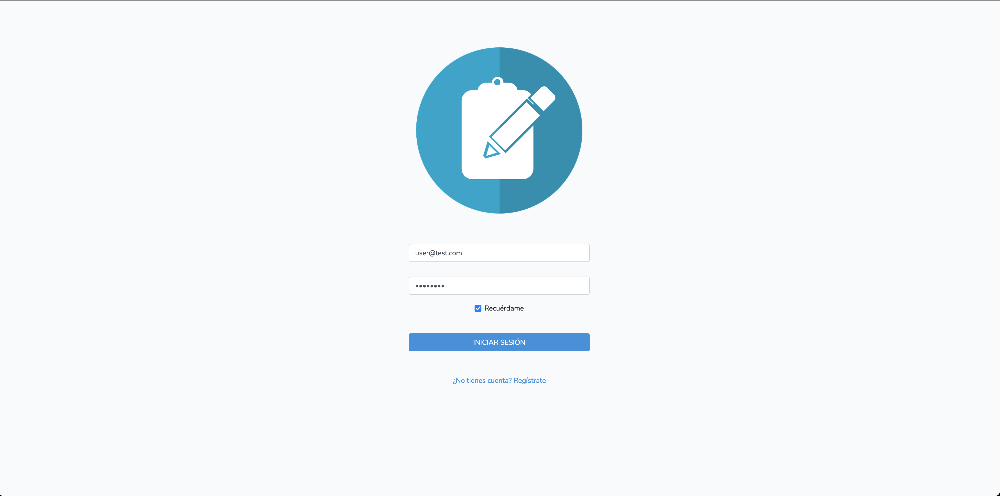 
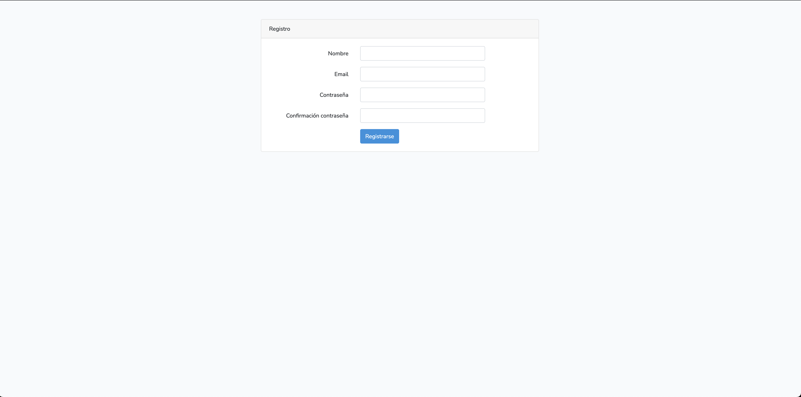 
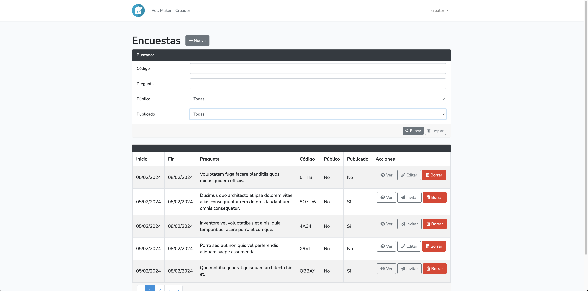 
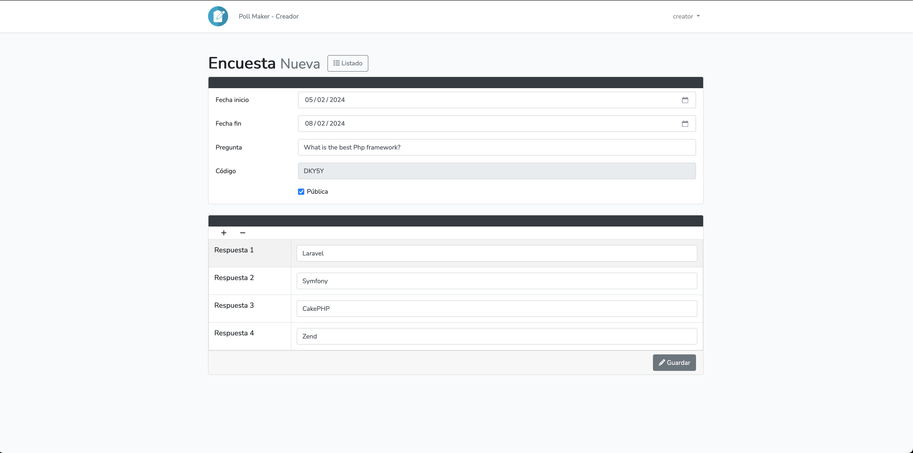 
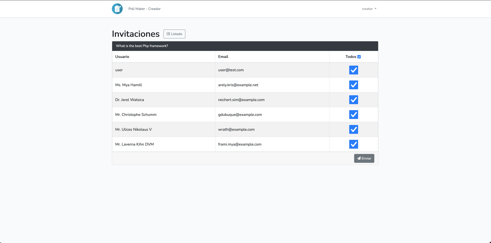 
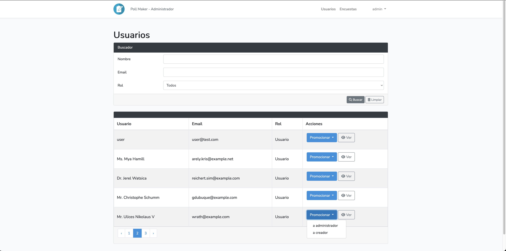 
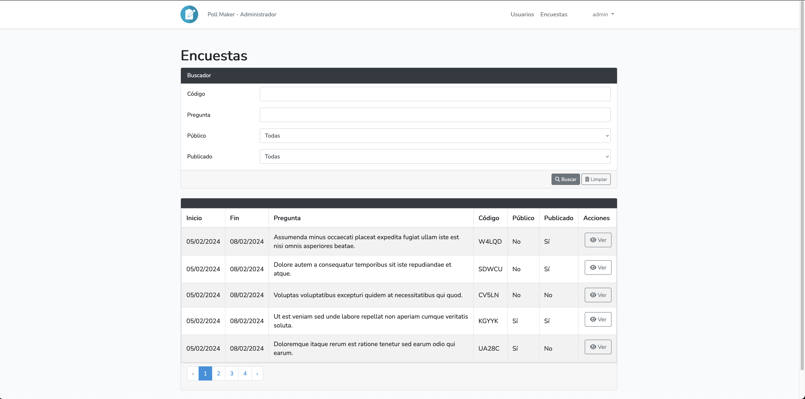 
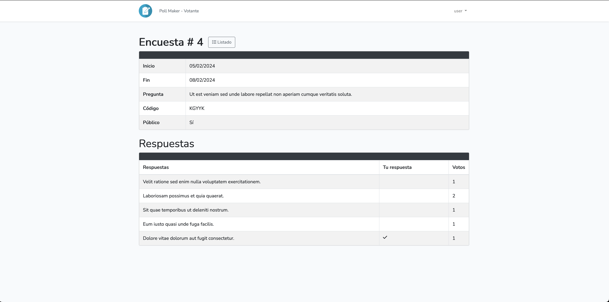 
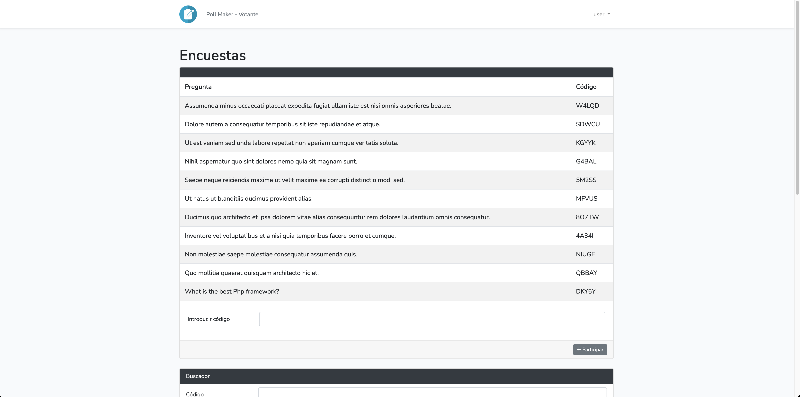 
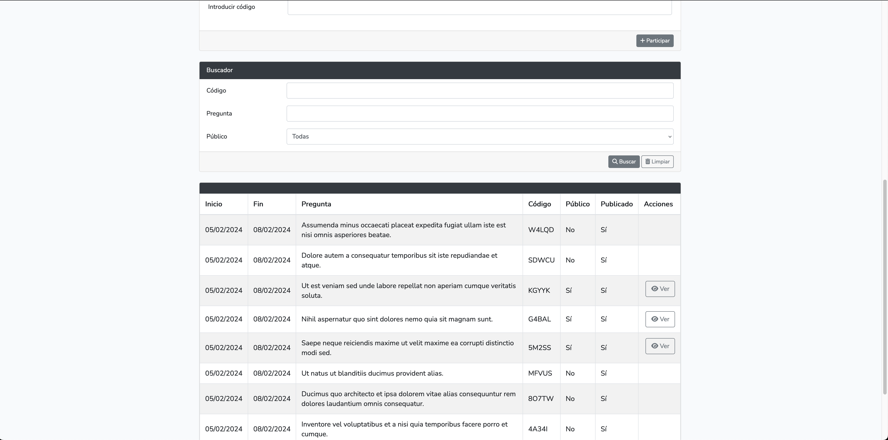 
 
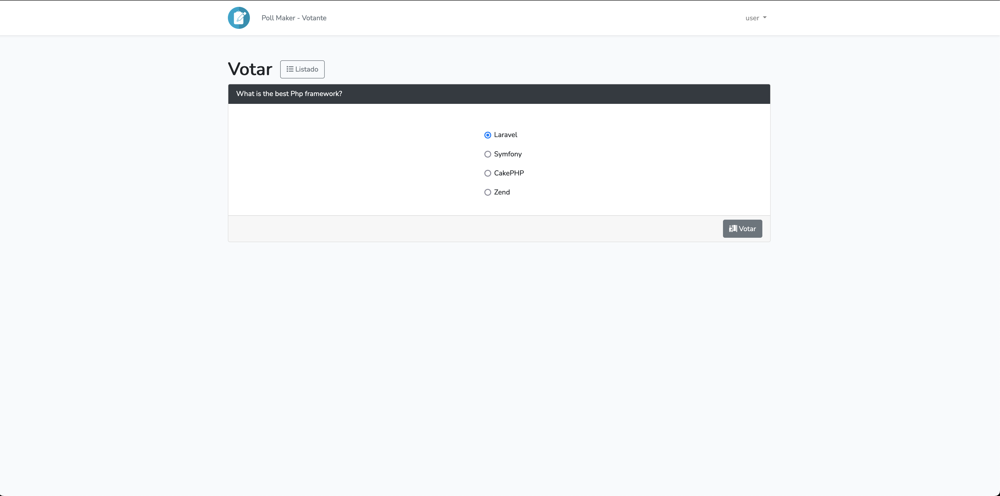 
